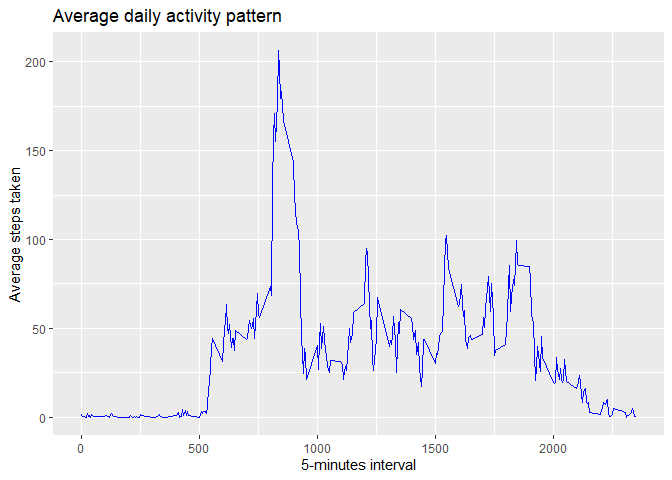
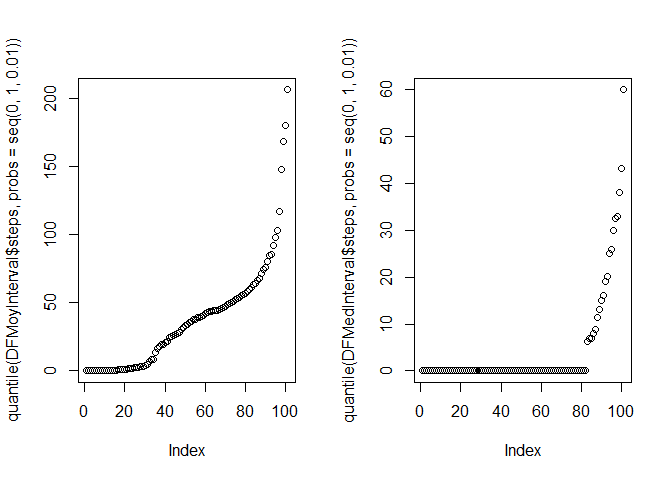
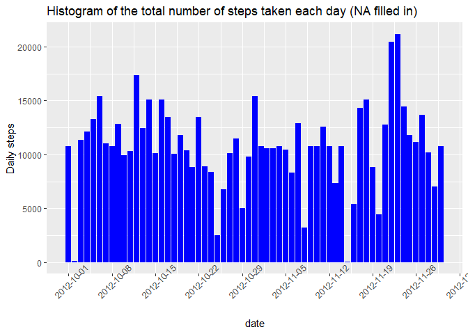
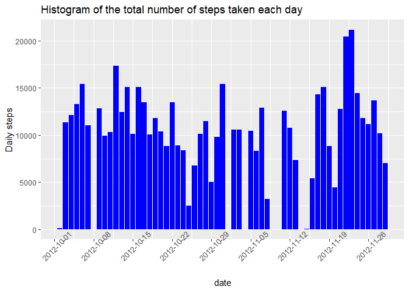
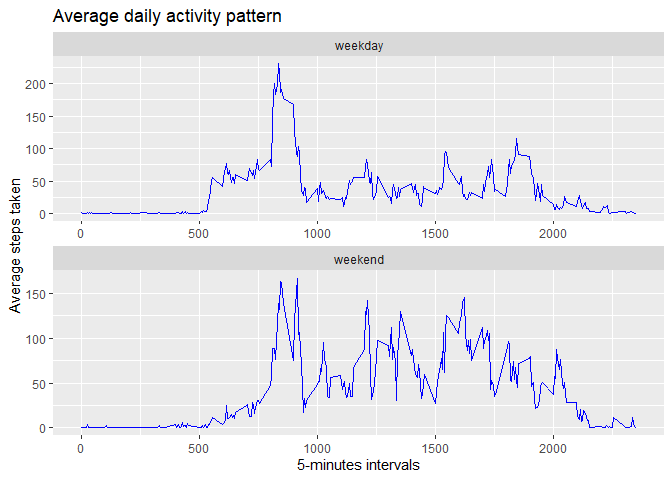

# Reproducible Research: Peer Assessment 1


## Loading and preprocessing the data
### 1. Loading data
I first load the csv data from the zip file. I consider there is only one csv file in the archive.

```r
filename <- unzip("activity.zip", list=TRUE)[1]
```
The name of the file is *activity.csv*

```r
data <- read.csv(unz("activity.zip", filename), header=T, quote="\"", sep=",")
str(data)
```

```
## 'data.frame':	17568 obs. of  3 variables:
##  $ steps   : int  NA NA NA NA NA NA NA NA NA NA ...
##  $ date    : chr  "2012-10-01" "2012-10-01" "2012-10-01" "2012-10-01" ...
##  $ interval: int  0 5 10 15 20 25 30 35 40 45 ...
```
### 2. Reshape data
1. First identify columns with NA's

```r
stepsNA <- anyNA(data$steps)
dateNA <- anyNA(data$date)
intervalNA <- anyNA(data$interval)
```
- Does steps variable contain NA? TRUE  
- Does date variable contain NA? FALSE  
- Does interval variable contain NA? FALSE  

2. Delete the lines with NA in the steps column

```r
clean_data <- data[!is.na(data$steps),]
head(clean_data)
```

```
##     steps       date interval
## 289     0 2012-10-02        0
## 290     0 2012-10-02        5
## 291     0 2012-10-02       10
## 292     0 2012-10-02       15
## 293     0 2012-10-02       20
## 294     0 2012-10-02       25
```

```r
str(clean_data)
```

```
## 'data.frame':	15264 obs. of  3 variables:
##  $ steps   : int  0 0 0 0 0 0 0 0 0 0 ...
##  $ date    : chr  "2012-10-02" "2012-10-02" "2012-10-02" "2012-10-02" ...
##  $ interval: int  0 5 10 15 20 25 30 35 40 45 ...
```

## Histogram of the total number of steps taken each day
1. To reduce the data and use ggplot2, we first need to load the appropriate packages

```r
library(tidyr)
library(dplyr)
```

```
## 
## Attachement du package : 'dplyr'
```

```
## Les objets suivants sont masqués depuis 'package:stats':
## 
##     filter, lag
```

```
## Les objets suivants sont masqués depuis 'package:base':
## 
##     intersect, setdiff, setequal, union
```

```r
library(ggplot2)
```
2. Then we can regroup the number of step by day and display the graph

```r
byDay <- clean_data %>% group_by(date) %>% summarise(total = sum(steps))

g <- ggplot(byDay, aes(x=as.Date(date), y=total)) + 
    geom_bar(stat='identity', fill="blue") + 
    labs(title = "Histogram of the total number of steps taken each day", x="date", y="Daily steps") + 
    scale_x_date(date_breaks = "1 week") +
    theme(axis.text.x = element_text(angle=45))
print(g)
```

<!-- -->

## Mean and median number of steps taken each day
We have found the total number of steps for each day in the byDay dataframe.
The mean and median functions should give us the values for this period:

```r
theMean <- as.integer(mean(byDay$total, na.rm=T))
theMedian <- as.integer(median(byDay$total, na.rm=T))
```
The **mean** is *10766* and the **median** is *10765*.

## What is the average daily activity pattern?
- Make a time series plot (i.e. type="1") of the 5-minute interval (x-axis) and the average number of steps taken, averaged accross all days (y-axis)

```r
meansPerInterval <- aggregate(steps ~ interval, data = data, mean)

ggplot(meansPerInterval, aes(y=steps, x=interval)) + 
    geom_line(color="blue") +
    xlab("5-minutes interval") +
    ylab("Average steps taken") +
    ggtitle("Average daily activity pattern")
```

<!-- -->

- Which 5-minute interval, on average accross all the days in the dataset, contains the maximum number of steps?

```r
maxValue <- max(meansPerInterval$steps)
maxStepsInterval <- meansPerInterval[meansPerInterval$steps == maxValue,]$interval
```
The 5-minutes interval which contains on average the **maximum number of steps** is the *835*th interval with  *206* steps on average (rounded).

## Imputing missing values
1. Calculate and report the total number of missing values in the dataset

```r
nbNA <- sum(as.numeric(is.na(data)))
```
There are *2304* **missing values** in the dataset.

2. Devise a strategy for filling in all the missing values  
The NA values tend to be grouped in whole days. It could be a good idea to fill them with the mean or the median of the corresponding 5-minutes intervals.
Choosing between mean and median might have a great impact on the results, let's see how they look:

```r
DFMoyInterval <- data.frame(steps = aggregate(steps ~ interval, 
                                              data = data, mean)$steps, 
                            interval=unique(data$interval))

DFMedInterval <- data.frame(steps = aggregate(steps ~ interval, data = data, median)$steps, interval=unique(data$interval))

summary(DFMoyInterval$steps)
```

```
##    Min. 1st Qu.  Median    Mean 3rd Qu.    Max. 
##   0.000   2.486  34.113  37.383  52.835 206.170
```

```r
summary(DFMedInterval$steps)
```

```
##    Min. 1st Qu.  Median    Mean 3rd Qu.    Max. 
##   0.000   0.000   0.000   3.962   0.000  60.000
```

```r
par(mfrow=c(1,2))
plot(quantile(DFMoyInterval$steps, probs = seq(0,1,0.01 )))
plot(quantile(DFMedInterval$steps, probs = seq(0,1,0.01 )))
```

<!-- -->

```r
par(mfrow=c(1,1))
```
The median will return mostly the 0 value, so I think the mean could be more interesting for this first exploration.


3. Create a new dataset that is equal to the original dataset, but with the missing data filled in

```r
noNA_data <- data

x <- 1
repeat{
    if(x < nrow(noNA_data)+1){
        if(is.na(noNA_data[x,]$steps)){
            noNA_data[x,]$steps <- DFMoyInterval[DFMoyInterval$interval == noNA_data[x,]$interval,]$steps
        }
    }
    else {
        break
    }
    x <- x+1
}

head(noNA_data)
```

```
##       steps       date interval
## 1 1.7169811 2012-10-01        0
## 2 0.3396226 2012-10-01        5
## 3 0.1320755 2012-10-01       10
## 4 0.1509434 2012-10-01       15
## 5 0.0754717 2012-10-01       20
## 6 2.0943396 2012-10-01       25
```
4.Conclude:
- Make a histogram of the total number of steps taken each day

```r
noNA_byDay <- noNA_data %>% group_by(date) %>% summarise(total = sum(steps))
gno <- ggplot(noNA_byDay, aes(x=as.Date(date), y=total)) + 
    geom_bar(stat='identity', fill="blue") + 
    labs(title = "Histogram of the total number of steps taken each day (NA filled in)", x="date", y="Daily steps") + 
    scale_x_date(date_breaks = "1 week") +
    theme(axis.text.x = element_text(angle=45))
print(gno)
```

<!-- -->
- Calculate and report the **mean** and **median** total number of steps taken per day

```r
noNA_theMean <- as.integer(mean(noNA_byDay$total))
noNA_theMedian <- as.integer(median(noNA_byDay$total))
```
The **new mean** is *10766* and the **new median** is *10766* when they formerly were the following:  
- **mean**: *10766*  
- **median**: *10765*.  
These values are very similar to the values calculated without filling in the NA values. If you remember, the summary of DFMoyInterval: *0, 2.4858491, 34.1132075, 37.3825996, 52.8349057, 206.1698113*  
The third quantile was the "52.835" value, meaning that 75% of the values are below *52*, when the Max was *206.170*.  
The **new median is slightly higher** than the previous one. This is the direct effect of adding values greater than 0 in empty intervals. **As the added values were mostly very low, their impact on the median level remains very limited**.

- What is the impact of imputing missing data on the estimates of the total daily number of steps?


```r
print(gno)
```

<!-- -->

```r
print(g)
```

<!-- -->
The overall look of the graph remains the same, but the days without measures disappear. 
  
## Are there differences in activity patterns between weekdays and weekends?
1. Create a new factor variable in the dataset with two levels – “weekday” and “weekend” indicating whether a given date is a weekday or weekend day.  
**Note:** *My computer is configured in french, so I had to use the day names in french...*

```r
maskWE <- weekdays(as.Date(noNA_data$date)) == "samedi" | weekdays(as.Date(noNA_data$date)) == "dimanche"

noNA_data$typeday <- NA
noNA_data[!maskWE, ]$typeday <- "weekday"
noNA_data[maskWE, ]$typeday <- "weekend"
noNA_data$typeday <- factor(noNA_data$typeday)
str(noNA_data)
```

```
## 'data.frame':	17568 obs. of  4 variables:
##  $ steps   : num  1.717 0.3396 0.1321 0.1509 0.0755 ...
##  $ date    : chr  "2012-10-01" "2012-10-01" "2012-10-01" "2012-10-01" ...
##  $ interval: int  0 5 10 15 20 25 30 35 40 45 ...
##  $ typeday : Factor w/ 2 levels "weekday","weekend": 1 1 1 1 1 1 1 1 1 1 ...
```
2. Make a panel plot containing a time series plot (i.e. type = "l") of the 5-minute interval (x-axis) and the average number of steps taken, averaged across all weekday days or weekend days (y-axis). See the README file in the GitHub repository to see an example of what this plot should look like using simulated data
- I first need to re-calculate separately the means for each interval on week days and weekends

```r
WE_meansPerInterval <- aggregate(steps ~ interval, data = noNA_data[noNA_data$typeday == "weekend",], mean)
WD_meansPerInterval <- aggregate(steps ~ interval, data = noNA_data[noNA_data$typeday == "weekday",], mean)
```
- Then I merge these dataframes into a new one with the appropriate typeday variable

```r
WE_meansPerInterval$typeday <- "weekend"
WD_meansPerInterval$typeday <- "weekday"

typeday_means <- rbind(WE_meansPerInterval, WD_meansPerInterval)
```
- Now that I have an appropriate dataframe, I can build my graphs

```r
ggplot(typeday_means, aes(y=steps, x=interval)) + 
    geom_line(color="blue") +
    xlab("5-minutes intervals") +
    ylab("Average steps taken") +
    ggtitle("Average daily activity pattern") +
    facet_wrap(~typeday,scales="free", ncol = 1)
```

<!-- -->
